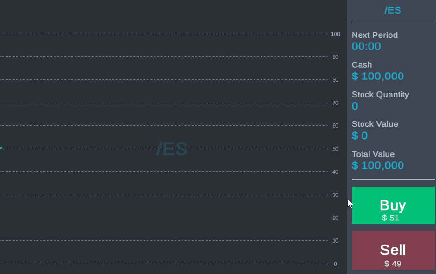
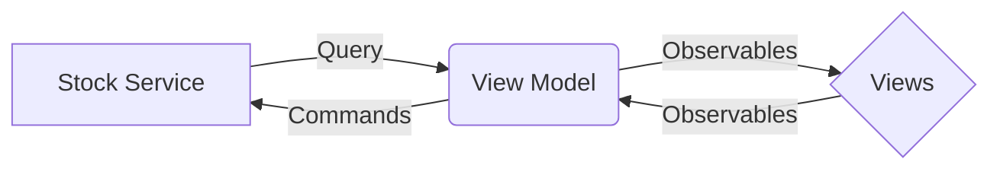

# Stock Game

This is a tech demo demonstrating a stock market terminal. This is a best-practice tech demo, not a game played for enjoyment.




### Gameplay
The game-play features a buy button, a sell button, accounting balances, a candlestick chart, and a volume chart. 

### Architecture
The Architecture is MVVM (Model-View-ViewModel). Required framework code resides in the Framework folder. This code is minimal (under 100 lines for the observable library), and is game agnostic.

### How To Play
- Press / Hold the Buy Button
- Press / Hold the Sell Button
- Observe things move

### Key Files

#### StockSceneStartup
Initialization script. Wires dependent services for the scene.

#### MockStockService
Business Logic Layer. Hidden behind the IStockService facade, as this implementation is designed to be swapped out.

#### StockViewModel
Binding source for the views. All visual elements connect to this script.

#### Varius Charts / Views
Responsible for displaying part of the UI. All connect to the StockViewModel as a datasource.

### UML


```
